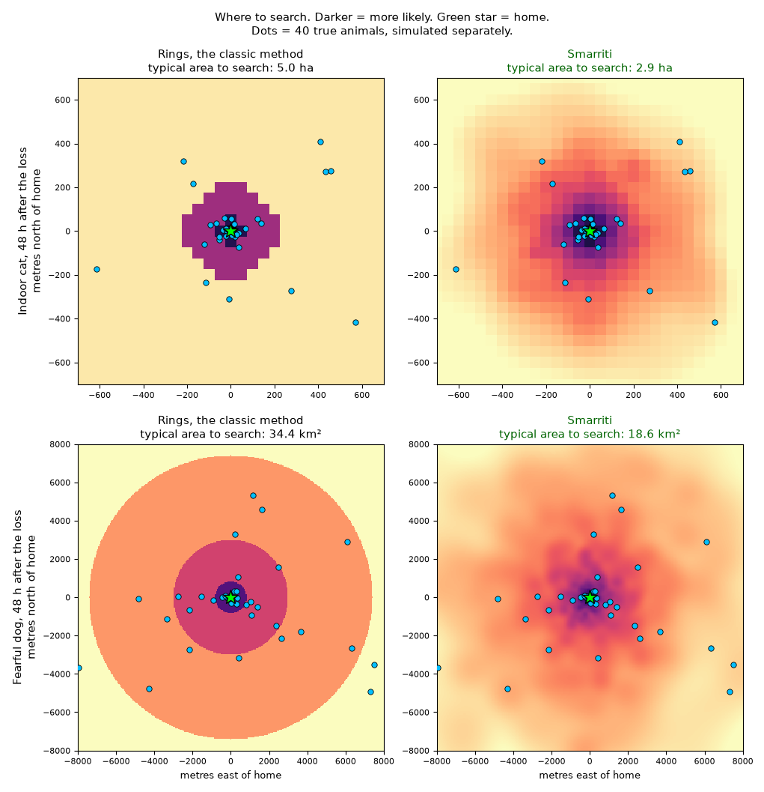

<h1 align="center">Smarriti</h1>

<p align="center"><b>Where a lost cat or dog is right now: a map from the first minute, made of maths and published studies.</b></p>

<p align="center">
  
</p>

Smarriti ("the lost ones", in Italian) is an open-source simulator for the first question after a
pet goes missing: where to look. It takes the animal, its home, the kind of place and the hour of
the loss; it releases thousands of virtual animals from the door and moves them hour by hour with
rules taken from the studies of lost pets — an indoor cat hides within a few houses, a fearful dog
runs for kilometres, a friendly one walks up to people. Where most of them are now, the map is
darkest. Every hour it also weighs the other story, that someone has already picked the animal up,
and says when phoning shelters and vets beats walking the streets.

> **Nothing after the loss, nothing by opinion.** The map comes from the case alone — no sightings,
> no crowd, no flyers — and every rule from a published study or open data. Every measurement below
> was predicted in writing before it was run.

## What it does today

- **Five kinds of animal**, each with its own rules for moving by day and by night, settling down,
  going home and being picked up: indoor cat, outdoor cat, friendly, wary and fearful dog — or just
  `cat` and `dog` when the temperament is unknown.
- **One case in, one map out**: a small JSON file (the animal, the home's coordinates, the hour of the
  loss, the collar, the zone and the floor) gives the map as PNG and GeoJSON in under a second.
- **Two states, hour by hour**: the chance that the animal is still loose, in someone's hands, back
  home by itself within a week, or dead.
- **What to do now**: the five places to search first and the hour to be there, the radius holding
  half and nine tenths of the chance, and whether to start calling shelters and vets, and within how
  many kilometres.
- **The place itself, from open data**: for a home in Italy, a 2 m grid of the surroundings built on
  its own — buildings with their heights, gardens, walls, roads, water, terrain, land cover, and the
  1 m LiDAR where it is open. Buildings are walls, water stops the animal except on a bridge, and the
  map comes at 4 m. The distances stay the calibrated ones: the place chooses the direction.

## Results

Measured on 2026-09-26 with `python -m sim.baseline`: 200 synthetic cases, 40 per kind of animal;
8,534 true animals simulated apart, each with every parameter drawn up to 30% away from the
calibrated one (so the simulator does not grade itself), read at a random hour between 12 hours and
10 days after the loss. The rival is the ring model of search and rescue (Koester, *Lost Person
Behavior*), given the exact distances the animal reaches at that hour, on the same 50 m grid. The
score is the area searched, from the most likely cell down, before reaching the animal: its typical
value (the geometric mean) for each map, and how often the simulator gets there with less.

| Animal | Rings, typical area | Smarriti, typical area | Smarriti searches less |
|---|---|---|---|
| **all 8,534 true animals** | 2.2 km² | **1.2 km²** (0.55×) | **67%** of the animals |
| indoor cat | 5.9 ha | 3.2 ha | 57% |
| outdoor cat | 3.2 km² | 1.0 km² | 81% |
| friendly dog | 2.5 ha | 2.1 ha | 54% |
| wary dog | 42 km² | 34 km² | 63% |
| fearful dog | 35 km² | 19 km² | 74% |

The rings give one value to a whole ring; the simulator gives every cell its own chance, so inside
each ring too the search starts where the animal most likely is. Every number, the prediction
written before it, and the predictions that went wrong are in [`docs/MISURE.md`](docs/MISURE.md).

Some milestones:

- **The published distances, reproduced.** The indoor cats of Huang et al. 2018 (1,210 lost cats)
  were found at 9, 39 and 137 m (the quartiles); the simulator's are 8.7, 40.3 and 140 m. Of the
  stray dogs of Dallas (Kremer 2021), 42% were picked up within 120 m and 70% within 1.6 km; the
  simulator reaches those shares at 106 m and 1.5 km.
- **A probability that means what it says.** On true animals simulated apart, 48 hours and a week
  after the loss: where the map marks half of the chance, the animal is there 45-55% of the time;
  where it marks nine tenths, 87-90%.
- **The place, built by itself.** One command reads OpenStreetMap, 3D-GloBFP, TINITALY, ESA
  WorldCover and the LiDAR of the Città Metropolitana di Napoli around a point; a second one lays
  them on a 2 m grid that the engine reads.

## What makes it different

**Nothing comes in after the loss.** The case is the only input (`sim/case.py`): no sightings, no
searches, no flyers. The map is ready in the first minute, for anyone, and it depends on no app, no
platform and no crowd.

**Two states, two answers.** A lost animal is either loose, and the place matters, or already in
someone's hands — picked up, at a vet, at a shelter — and then only finding that person does. The
simulator follows both stories at once, as competing risks, and says when the second has become the
likelier.

**Every number has its source, and none is ours.** The rules are fit to published studies and open
data — lost cats and dogs (Huang 2018, Lord 2007, Kremer 2021), where pet cats spend their time
(Hanmer 2017) — never to cases collected by us. Each number sits next to its source in
[`docs/riferimenti.md`](docs/riferimenti.md).

**Predicted, then measured.** A measurement opens with its prediction, written before the run, and
keeps it when it turns out wrong; the rereadings and the explorations say so. 29 measurements so far
in `docs/MISURE.md`. Every error becomes a rule and a check that stops it from coming back: 60 so far,
in [`docs/lessons.md`](docs/lessons.md).

**Tests that cannot pass by luck.** A statistical test passes only when its interval at four
standard errors sits inside the tolerance; a known failure is a strict `xfail` that cites its
measurement. `pytest -q` runs 102 tests in about 40 seconds.

**The address stays home.** Building the place sends the open-data services a box rounded to 0.01°,
a few kilometres wide: never the address, never the exact point.

## Get started

Python 3.12 (on Linux and macOS: `python3.12 -m venv .venv` and `.venv/bin/python`):

```bash
git clone https://github.com/namespaceMarcello/smarriti && cd smarriti
py -3.12 -m venv .venv
.venv/Scripts/python -m pip install numpy scipy matplotlib pytest pyshp tifffile
.venv/Scripts/python -m sim cases/esempio-gatto.json --now 2026-09-22T08:00 --out out/
.venv/Scripts/python -m pytest -q
```

A case is a small JSON file (`cases/`):

```json
{
  "category": "cat_indoor",
  "home": {"lat": 40.85, "lon": 14.27},
  "lost_at": "2026-09-20T19:00",
  "collar": false,
  "area": {"zone": "apartment_blocks", "floor": 3}
}
```

`category` is `cat_indoor`, `cat_outdoor`, `dog_friendly`, `dog_wary`, `dog_fearful`, `cat` or
`dog`; `zone` is `suburban_houses`, `apartment_blocks`, `city_center`, `rural` or `park`, with
optional circles of another zone (`patches`). Into `out/` go the map (`.png`, `.geojson`) and the
answer (`.json`): the states, the places and hour to search, the two radii, and whether to call.

For a home in Italy, the place in 3D:

```bash
.venv/Scripts/python -m proto.luogo3d.fetch place.json place/   # place.json: {"lat": .., "lon": ..}
.venv/Scripts/python -m proto.luogo3d.world place.json place/   # place/world.npz, the 2 m grid
```

and in the case, `"place": {"world": "<world.npz, relative to the case file>"}`, with `home` at the
same point.

## Status

September 2026: the simulator is calibrated and tested, the place is in the engine, the website
comes next.

| Step | Where it is |
|---|---|
| Five animals calibrated on the published distances and times | done |
| The map against the rings | ahead: 0.55 of the rings' typical area, less area for 67% of the animals |
| The place in 3D from open data | in the engine: buildings, gardens, walls, roads, water; heights as an option |
| The lost cat that hides (sheds, garages, under houses) | in progress |
| The website: the case in, the map out, on any phone | next |

What is missing:

- The outdoor cat's distances are within 23% of the published quartiles; the other animals within
  12%.
- 82% of the simulated dogs that are picked up are picked up within 5 days; in Dallas over 90% of the
  reunions come within 5 days (Kremer 2021).
- On the GPS tracks of 437 pet cats in four countries (Cat Tracker, Kays et al. 2020) the place is
  associated with where the cats are, but it barely improves the forecast of where a cat at home is
  (at most 0.004 nats per position). How a lost cat, which hides, differs is the step in progress.
- The documents are in Italian; the code and its comments are in English.

## How it is built

Smarriti is written by **Claude Code, Anthropic's AI coding agent, with Marcello Costagliola
leading** — the direction, the questions and every decision; every commit says so. The
method: read the problem like a genome, every study and every open dataset a read to align; write the
prediction before each measurement; keep the result even when it is zero.

| Document (Italian) | Content |
|---|---|
| [`docs/progetto.md`](docs/progetto.md) | what we build, and in what order |
| [`docs/simulatore.md`](docs/simulatore.md) | the model: states, movement, zone, the place, parameters, calibration, outputs |
| [`docs/matematica.md`](docs/matematica.md) | the mathematics behind it |
| [`docs/riferimenti.md`](docs/riferimenti.md) | the studies and the open data, each number with its source |
| [`docs/MISURE.md`](docs/MISURE.md) | every measurement, prediction first |
| [`docs/lessons.md`](docs/lessons.md) | every error, with the rule and the check it produced |
| [`docs/STATO.md`](docs/STATO.md) | decisions, open problems, next steps |

## Acknowledgements

The rules and their checks come from Huang et al. 2018 (1,210 lost cats), Lord et al. 2007 (lost cats and dogs,
Ohio), Kremer 2021 (Dallas Animal Services), Hanmer, Thomas & Fellowes 2017, Fardell et al. 2021,
Whitney & Mehlhaff 1987 and the I-CAD registry; the ring model from Koester's *Lost Person
Behavior*. The GPS tracks of pet cats are the Cat Tracker project's (Kays et al. 2020, Movebank,
CC0 1.0). The place: © OpenStreetMap contributors (ODbL), 3D-GloBFP (Che et al. 2024, CC BY 4.0),
TINITALY/1.1 (INGV, CC BY 4.0), Copernicus DEM GLO-30 (ESA), ESA WorldCover 2021 (CC BY 4.0), the
LiDAR of the Città Metropolitana di Napoli (CC BY-SA 4.0).

## License

AGPL-3.0: improvements stay in the commons.
